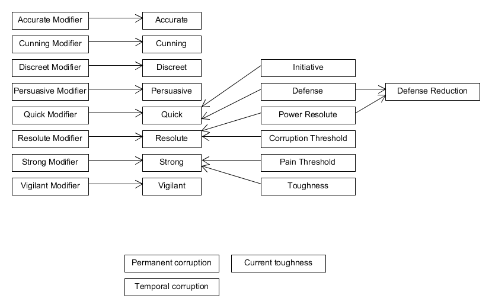

# Stats

## Attributes

These are the main stats, which all characters have.

* Accurate
* Cunning
* Discreet
* Persuasive
* Quick
* Resolute
* Strong
* Vigilant

## Secondary Attributes

Always present too. Generated from attributes.

* Corruption Threshold
* Defense
* Pain Threshold
* Toughness

Note that defense is dependent on the armor, so there will be a value for each armor set.

### Formulas

The secondary attributes are calculated like this:

* Corruption Threshold: Resolute / 2 (rounded up)
* Defense: Quick - armor malus
* Pain Threshold: Strong / 2 (rounded up)
* Toughness: Strong (minimum 10)

Defense may be modified by more things than the armor, for example the robust trait. For this it is better using this formula:

* Defense = Quick - Defense Reduction

## Attribute modifiers

These are the modifiers calculated from attributes.

## Corruption

* Permanent corruption

## Additional Stats

These are not commented among the main attributes, but still are so important that all characters have it.

### Armor

The armor value depends on the armor used. But there are several sources for armor, such as traits, which can stack.

Some of these sources are not real armor. For example robust ignores damage.

### Resolute for Powers

* Resolute for powers: resolute - armor malus

Note that resolute for powers is dependent on the armor, so there will be a value for each armor set.

### Spent Stat

The following stats can be "spent", meaning they can have a maximum and a current value:

* Corruption (temporal corruption)
* Toughness

### Initiative Attributes

By default quick is used for initiative.

## Dynamic Stats

These depend on things such as abilities or equipment.

### Damage Bonus

The character may have several damage bonus:

* Base damage
* Single attack
* For a type of weapon
* Advantage attacks

### Attack Attributes

By default accuracy is used for the attacks.

The following attacks may have an additional attribute:

* Advantage
* Normal attack

In these cases the additional attribute should be noted.

### Defense Value

By default quick is used for defense. Some aspects may add additional attributes.

Defense should be noted for all the possible attributes.

Defense is modified by aspects, for example armors with the cumbersome quality or the berserker ability.

### Initiative Attributes

Some aspects may add additional attributes.

### Mystical Power Ability

By default mystical powers are used with resolute modified by the armor encumbrance. Some aspects may change this formula. Some aspects may add additional attributes.

