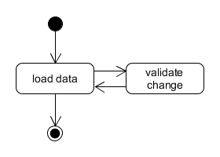

# Character Creation

This aspect should be tailored to the application arquitecture, which is meant to be a client-server application.

This means that the UI and user interactions will be kept in a small application, while all the business logic will be stored in the server.

In a simplified way the interaction is reduced to these steps:

* The client loads the initial data
* The user makes a change, which the client validates against the server, reloading data

## Client

The client wont make any decision. All the options will be received from the server, and it will ask the server to validate any change.

Costs, available options or any dynamic change such as unlocked professions will be handled by the server. All this data will be pulled periodically, when the client ask for a validation of the current status.

## Server

All the business logic will be contained in the server, along validations to make sure the data sent by the client is always valid. It is a reactive piece of the process.

## Session and State

The character creation state is stored in the client. The server will be stateless.

For this reason the validation requests will contain all the current data.
