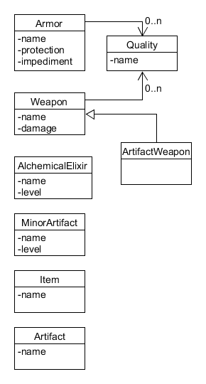

# Items

Maybe they should be reduced to:

* Equipable
* Usable

## Equipment

Some items, such as armors and weapons, modify a character when equipped.

Equipment has some dynamic stats:

* Protection (can contain multiple values)
* Impediment
* Damage
* Number of hands required
* Price
* Blackmarket flag

### Armor Impediment

* Light: -2
* Medium: -3
* Heavy: -4

Qualities, such as flexible or cumbersome, may modify this.

## Item Levels

Item linked to an ability, mostly craftable items, have a level.

* Elixirs
* Minor artifacts
* Traps

Levels increase the effectiveness of an item.

## Equipment Slots

Each character can have any number of armors, showing the stats using each of them.

A character may have multiple sets of weapons, but they should fit in two hands (two one-handed or one two-handed)

## Artifacts

These are complex items, which may include several abilities.

How to handle this?

## Prices

The price of weapons and armors is affected by the number of qualities.
