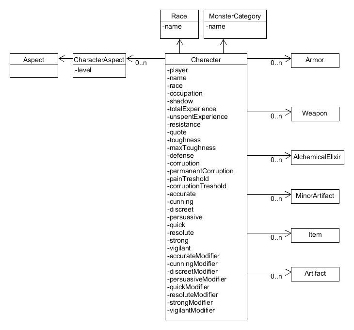

# Character

## Monsters

Monsters are covered by characters.

The main exception is that the monster have their own set of races.

## Calculated Values

All the values which are generated from attributes, such as modifiers or secondary attributes, are added to the model.

Depending on the context they will be handled in different ways, in some cases the object will generate them, while in others they will just be stored.

## Limits

Attributes have a minimum value of 5, and a maximum value of 15. Of course this is applied only when creating characters through a template.

These values may change, for example by acquiring abilities.

The sum of all the attributes should equal 80.

There are two recommended spreads for attributes.

## Costs

All the ranked values, such as abilities or boons, have a value. They follow these formulas:

* Sum(level) * 10
* Sum(level) * 5
* Negative of Sum(level) * 10

These costs will matter when creating or changing characters, and when calculating the experience cost.

## Armor

The armor value depends on the armor used, combined with other sources. These sources should be noted separatedly.

## Actions

Abilities refer to the action they require. These are:

* Active
* Free
* Passive
* Reaction
* Special

Each level may use one or more of these actions.

## Magic

Magic abilities have a special requirement:

* Mystical powers are linked to a tradition
* Each tradition has their own ability
* Buying a mystical power above the rank of the related tradition ability gives permanent corruption

For example, having one point in Theurgy and buying the power of lay hands at adept gives one point of permanent corruption.

Some rituals allow summoning or creating creatures. These have their own stat block.

Magical powers have their own set of stats, such as attacks which increase in power as the power level increases.

## Aspects

The aspects cover all these:

* Abilities
* Boons
* Burdens
* Monstrous Traits
* Powers
* Rituals
* Traits

They are meant to be flexible, adapting to the complex needs of all these components.

Some special notions to keep in mind:

* Races may have their own set of aspects
* Each magic tradition is represented by a magical ability
* Powers are linked to at least one magical tradition
* Rituals are linked to at least one magical tradition
* Some rituals are linked to at least one magical specialization
* Some rituals are linked to a character (a summon)
* Some rituals are a higher form of another

## Actions

Each character has two actions:

* Movement
* Active action

Some aspects can modify this. Should the actions be part of the model?

## Monstrous Traits

Some monstrous traits require others. For example acidic attack requires acidic blood.

## Additional Effects

How to handle things such as attribute bonus from burdens?

* Beast Lore at adept allows choosing one of several monster categories as specialty.
* Several abilities change which attribute can be used for combat
* Exceptional attribute increases the value of an attribute
* Robust changes the formula for defense
* Traits and abilities, such as robust, change the armor value
* Contacts makes reference to a group (freeform input)
* Magic abilities have an impact on how much corruption a character gets from learning magic
