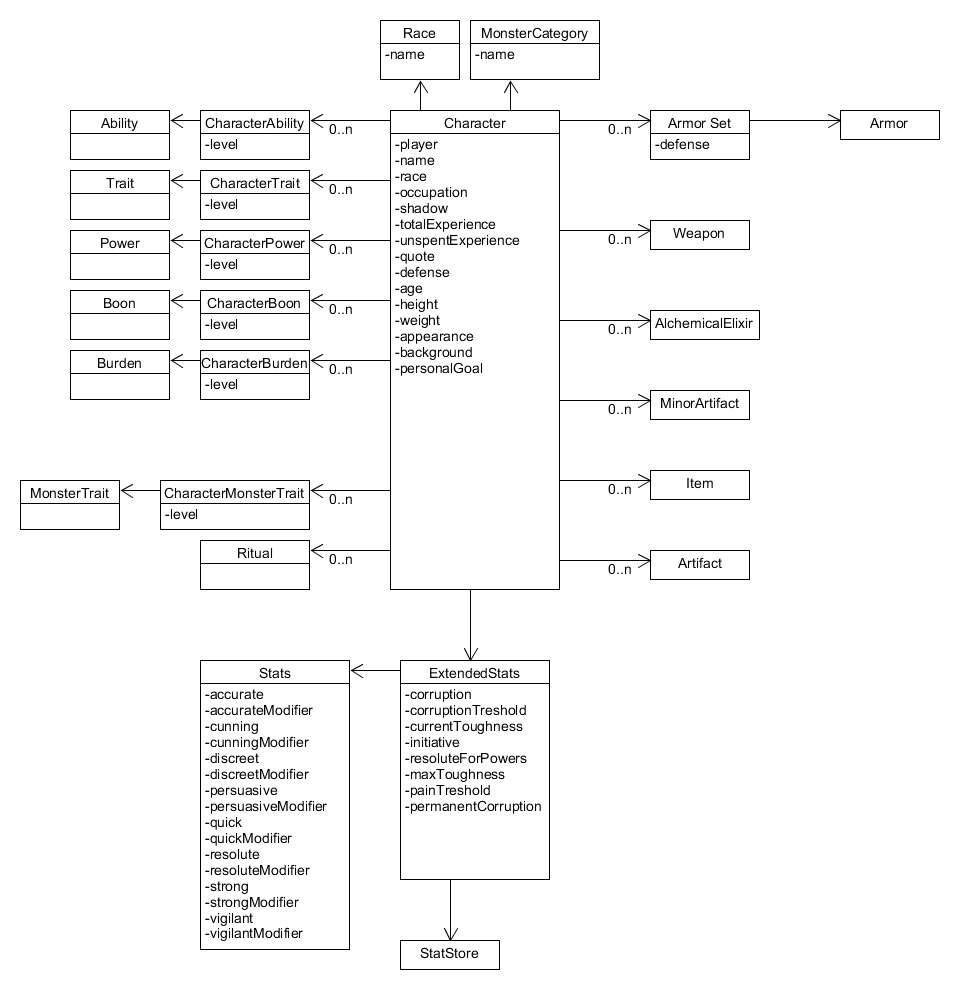

# Character

## Monsters

Monsters are covered by characters.

## Calculated Values

All the values which are generated from attributes, such as modifiers or secondary attributes, are added to the model.

Depending on the context they will be handled in different ways, in some cases the object will generate them, while in others they will just be stored.

## Costs

All the ranked values, such as abilities or boons, have a value. They follow these formulas:

* Sum(level) * 10
* Sum(level) * 5
* Negative of Sum(level) * 10

These costs will matter when creating or changing characters, and when calculating the experience cost.

## Additional Effects

How to handle things such as attribute bonus from burdens?
