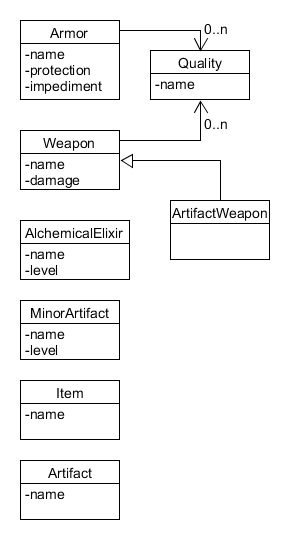

# Items

Maybe they should be reduced to:

* Equipable
* Usable

## Equipment

Some items, such as armors and weapons, modify a character when equipped.

## Armor Impediment

* Light: -2
* Medium: -3
* Heavy: -4

Qualities, such as flexible or cumbersome, may modify this.

## Artifacts

These are complex items, which may include several abilities.

How to handle this?
